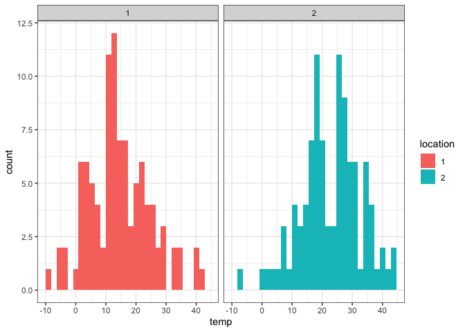
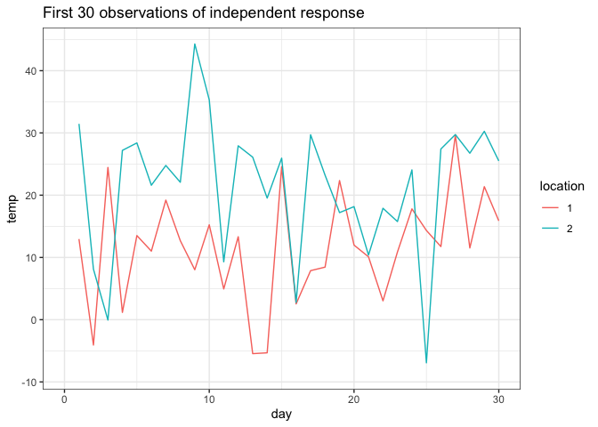
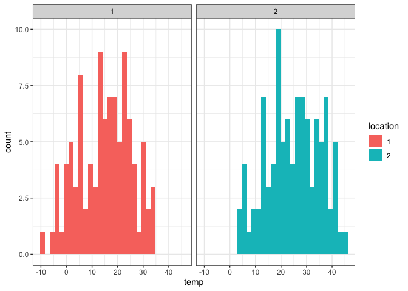
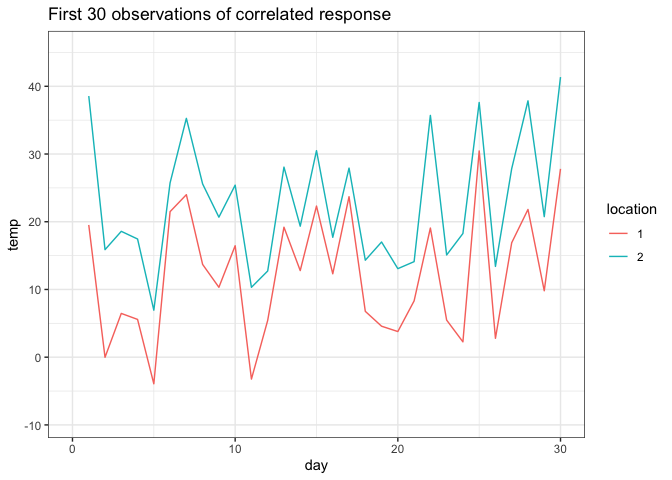

Lecture 6: Multivariate Normal demo
================

#### Multivariate Normal Distribution

First we will start with the a bivariate normal distribution: y \~
N(theta,sigma), where theta is a mean vector and sigma = sigmasq \* I is
a covariance matrix.

To provide a motivating context, not consider jointly estimating the
temperature at Bridger Bowl *and* Big Sky Resort.

##### 1. Simulate independent bivariate normal

Simulate a set of temperature values from each location, where the
temperature values are independent (sigma = sigmasq \* I)

``` r
library(mnormt)
n <- 100
theta <- c(15,25)
sigma <- diag(2) * 100
fake_temperatures <- rmnorm(n, theta , sigma)
```

Then create a few graphs to show marginal distribution of temperature as
well as how the temperatures evolve in time.

``` r
library(reshape2)
melt(fake_temperatures, value.name = 'temp') %>% 
  rename(location = Var2) %>%
  mutate(location = factor(location)) %>% 
  ggplot(aes(x =temp, fill = location)) + 
  geom_histogram() +
  facet_wrap(.~location) + theme_bw() 
```

<!-- -->

``` r
melt(fake_temperatures, value.name = 'temp') %>% 
  rename(location = Var2, day = Var1) %>%
  mutate(location = factor(location)) %>%
  ggplot(aes(y =temp, x = day, color = location )) + 
  geom_line() + theme_bw() + xlim(0,30) + 
  ggtitle('First 30 observations of independent response')
```

<!-- -->

##### 2. Simulate correlated bivariate normal

Simulate a set of temperature values from each location, where the
temperature values are not independent (sigma = sigmasq \* H), where H
is a correlation matrix. (Note there are some constraints we will
discuss later)

``` r
sigma <- matrix(c(1, .9, .9, 1), nrow = 2, ncol = 2) * 100
fake_temperatures_corr <- rmnorm(n, theta , sigma)
```

Then create a few graphs to show marginal distribution of temperature as
well as how the temperatures evolve in time.

``` r
melt(fake_temperatures_corr, value.name = 'temp') %>% 
  rename(location = Var2) %>%
  mutate(location = factor(location)) %>% 
  ggplot(aes(x =temp, fill = location)) + geom_histogram() +
  facet_wrap(.~location) + theme_bw()
```

<!-- -->

``` r
melt(fake_temperatures_corr, value.name = 'temp') %>% 
  rename(location = Var2, day = Var1) %>%
  mutate(location = factor(location)) %>%
  ggplot(aes(y =temp, x = day,color = location )) + 
  geom_line() + theme_bw() + xlim(0,30) +
  ggtitle('First 30 observations of correlated response')
```

<!-- -->

##### 3. Write STAN code for bivariate normal

Write stan code that will allow you to estimate theta and sigma
(including H)

``` stan
data {
  int<lower=0> p;
  int<lower=0> N;
  matrix[N,p] y;
}

parameters {
  vector[p] theta;
  corr_matrix[p] H;
  real<lower = 0> sigma;
}

model {
  for(i in 1:N){
    y[i,:] ~ multi_normal(theta, sigma*H);
  }
}
```

##### 4. Use STAN to estimate bivariate normal parameters

Use your stan code to estimate theta and sigma (including H and sigmasq)

``` r
indep_mvn <- stan("multi_norm.stan", 
                  data=list(N = nrow(fake_temperatures), 
                            p = ncol(fake_temperatures), 
                            y=fake_temperatures))
```

``` r
print(indep_mvn)
```

    ## Inference for Stan model: multi_norm.
    ## 4 chains, each with iter=2000; warmup=1000; thin=1; 
    ## post-warmup draws per chain=1000, total post-warmup draws=4000.
    ## 
    ##             mean se_mean    sd    2.5%     25%     50%     75%   97.5% n_eff
    ## theta[1]   14.47    0.02  1.01   12.50   13.77   14.48   15.15   16.45  4207
    ## theta[2]   22.93    0.02  1.02   20.97   22.24   22.93   23.61   24.91  4102
    ## H[1,1]      1.00     NaN  0.00    1.00    1.00    1.00    1.00    1.00   NaN
    ## H[1,2]      0.11    0.00  0.10   -0.08    0.05    0.11    0.18    0.30  4177
    ## H[2,1]      0.11    0.00  0.10   -0.08    0.05    0.11    0.18    0.30  4177
    ## H[2,2]      1.00    0.00  0.00    1.00    1.00    1.00    1.00    1.00  3770
    ## sigmasq   107.32    0.18 11.05   87.44   99.58  106.54  114.08  131.11  3975
    ## lp__     -560.46    0.03  1.37 -563.88 -561.13 -560.15 -559.47 -558.74  2051
    ##          Rhat
    ## theta[1]    1
    ## theta[2]    1
    ## H[1,1]    NaN
    ## H[1,2]      1
    ## H[2,1]      1
    ## H[2,2]      1
    ## sigmasq     1
    ## lp__        1
    ## 
    ## Samples were drawn using NUTS(diag_e) at Wed Feb  3 11:33:55 2021.
    ## For each parameter, n_eff is a crude measure of effective sample size,
    ## and Rhat is the potential scale reduction factor on split chains (at 
    ## convergence, Rhat=1).

``` r
corr_mvn <- stan("multi_norm.stan", 
                 data=list(N = nrow(fake_temperatures_corr),
                           p = ncol(fake_temperatures_corr), 
                           y=fake_temperatures_corr))
```

``` r
print(corr_mvn)
```

    ## Inference for Stan model: multi_norm.
    ## 4 chains, each with iter=2000; warmup=1000; thin=1; 
    ## post-warmup draws per chain=1000, total post-warmup draws=4000.
    ## 
    ##             mean se_mean    sd    2.5%     25%     50%     75%   97.5% n_eff
    ## theta[1]   14.86    0.02  1.03   12.84   14.18   14.88   15.57   16.83  2008
    ## theta[2]   24.87    0.02  1.03   22.82   24.20   24.90   25.58   26.86  1993
    ## H[1,1]      1.00     NaN  0.00    1.00    1.00    1.00    1.00    1.00   NaN
    ## H[1,2]      0.91    0.00  0.02    0.88    0.90    0.92    0.93    0.94  1754
    ## H[2,1]      0.91    0.00  0.02    0.88    0.90    0.92    0.93    0.94  1754
    ## H[2,2]      1.00     NaN  0.00    1.00    1.00    1.00    1.00    1.00   NaN
    ## sigmasq   109.52    0.37 15.14   83.98   99.28  107.91  118.33  143.41  1689
    ## lp__     -473.69    0.04  1.38 -477.16 -474.40 -473.38 -472.67 -471.94  1423
    ##          Rhat
    ## theta[1]    1
    ## theta[2]    1
    ## H[1,1]    NaN
    ## H[1,2]      1
    ## H[2,1]      1
    ## H[2,2]    NaN
    ## sigmasq     1
    ## lp__        1
    ## 
    ## Samples were drawn using NUTS(diag_e) at Wed Feb  3 11:34:23 2021.
    ## For each parameter, n_eff is a crude measure of effective sample size,
    ## and Rhat is the potential scale reduction factor on split chains (at 
    ## convergence, Rhat=1).

##### 5. Thoughts About Correlation

In many statistical models there is an assumption about independence.
When independence is violated, uncertainty is under estimated and in
incorrect inferences can be made.

While lack of independence often has a negative connotation, in spatial
statistics we can actually exploit correlation. For instance, by knowing
the temperature at the weather station at Bozeman High School or Bridger
Bowl, we can estimate temperature at other locations.

#### Conditional Normal distribution

Now there is one more location that we are interested in learning the
temperature, maybe Rendezvous Ski Trails in West Yellowstone.

Let’s assume that
$$\\begin{bmatrix} y\_{bridger}\\\\ y\_{big sky}\\\\ y\_{rendezvous} \\end{bmatrix} \\sim N(\\begin{bmatrix} 15 \\\\ 15 \\\\ 15\\end{bmatrix}, 100\\begin{bmatrix} 1 & .3 & .2 \\\\ .3 & 1 & .5 \\\\ .2 & .5 & 1
\\end{bmatrix})$$

###### 1. Simulate one data point for Bridger and Big Sky

Simulate a single realization from the distribution for Bridger and Big
Sky (ignoring Rendezvous for now).

``` r
mu <- c(15, 15, 12)
H <- matrix(c(1, .3, .2,
              .3, 1, .5,
              .2, .5, 1), byrow = T, ncol = 3, nrow = 3)
Sigma <- 100 * H

fake_temperatures1 <- rmnorm(1, mu[1:2] , Sigma[1:2, 1:2])
```

The temperatures for Bridger Bowl and Big Sky are approximately 20.9,
15.82.

###### 2. Estimate Rendezvous, conditional on the data point from Bridger and Big Sky

Conditional on the values from the previous question, construct the
distribution for the Rendezvous temperature. Add this to a graph with a
marginal temperature. Rerun this a few times (with a different seed) to
see how it changes.

``` r
mu_given <- mu[3] + Sigma[3,1:2] %*% solve(Sigma[1:2,1:2]) %*% (fake_temperatures1 - mu[1:2])
sigma_given <- Sigma[3,3] - Sigma[3,1:2] %*% solve(Sigma[1:2,1:2]) %*% Sigma[1:2, 3]

x_seq <- seq(-15, 35, by = 1)

tibble(x = rep(x_seq,2), 
       dens = c(dnorm(x_seq, mu[3], sqrt(Sigma[3,3])), 
                dnorm(x_seq, mu_given, sqrt(sigma_given))),
      type = rep(c('marginal','conditional'), each = length(x_seq) )) %>% ggplot(aes(x = x, y = dens, group = type, color = type)) + geom_line() + theme_bw() + geom_vline(xintercept = fake_temperatures1)
```


